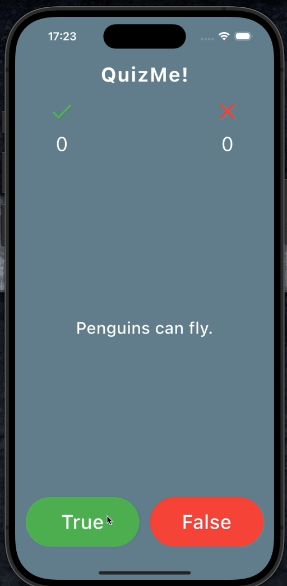

# QuizMe

Simple Quiz App developed as a part of App-brewery course

## Features
- Uses a static JSON files as a quiz-bank
- Choose random quiz-bank from list of available quiz banks
- Option to "Restart" game at the end
- makes use of just_audio sound library 
- Plays appropriate sounds for Correct/Incorrect answer
- Shows number of Correct/Incorrect answers
- Plays gap-less background music 
- uses modular approach

## Todo
- create and validate quiz-bank schema
- pause background music when app goes to background
- error handling ( specially for async calls)
- Write tests

## Note
- all the sounds file are sourced from [Free Sound](https://freesound.org/)
- app icon was made with [App Icon](https://www.appicon.co/)

## Demo

